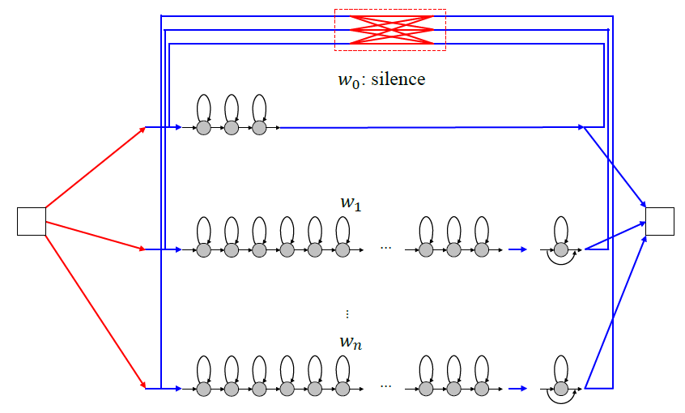
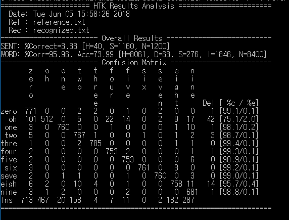

## Speech Recognizer using Gaussian Mixture model-Hidden Markov model(GMM-HMM)

**Speech recognition** is the task of identifying a sequence of words uttered by a speaker, given the acoustic signal. We can view speech recognition as a problem in most-likely-sequence explanation. This is the problem of computing the most likely sequence of state variables(words), given a sequence of observations(feature vectors extracted from the audio signal). The most likely sequence can be computed with the help of Bayes' rule

* <a href="https://www.codecogs.com/eqnedit.php?latex=argmax_{word_{1:n}}P(word_{1:n}|sound_{1:t})=argmax_{word_{1:n}}P(sound_{1:t}|word_{1:n})P(word_{1:n})" target="_blank"></a>
* <a href="https://www.codecogs.com/eqnedit.php?latex=P(sound_{1:t}|word_{1:n})&space;:&space;accoustic&space;\&space;model" target="_blank"></a>
* <a href="https://www.codecogs.com/eqnedit.php?latex=P(word_{1:n})&space;:&space;language&space;\&space;model" target="_blank"></a>

Most speech recognition systems use a language model that makes the Markov assumption that the current state word depends only on a fixed number n of previous states and represent word as a single random variable taking on a finite set of values, which makes it a HMM

### Model overview

* Acoustic Model
  * Phone Model : A HMM model for each phone
    * onset-middle-end 3 states
    * EXAMPLE: phone [m] pass through onset-mid-end states
  * Word Model : A HMM model for each phone
    * Concatenation of HMM of phones given word

* Language Model
  * Use '''unigram.txt''' for word initial probability
  * Use '''bigram.txt''' for word transition probability

* Observations
  * Size of sound sequence depends on the file.
  * Dimension of feature vector is 39. Therefore, each state is gaussian mixture with 39 dimensions.

* Model Structure

<p align="center"></p>

### code

```header.py``` : GMM Parameters
```main.py``` : Doing Predict
```model.py``` : Construct phone HMMs, word HMMs, final structure
```util.py``` : Some functions to compute


### Prerequisites

* [Python3.5+](https://www.continuum.io/downloads)

### Usage & Example

```shell
python main.py
```

### Result

<p align="center"></p>
